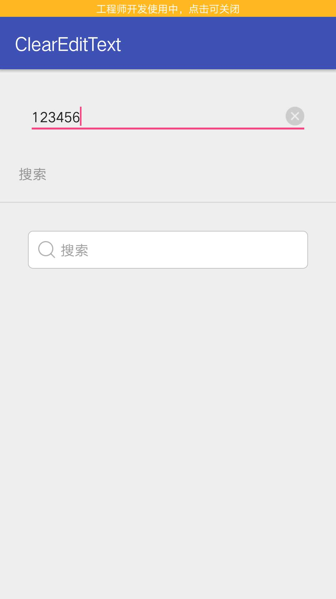
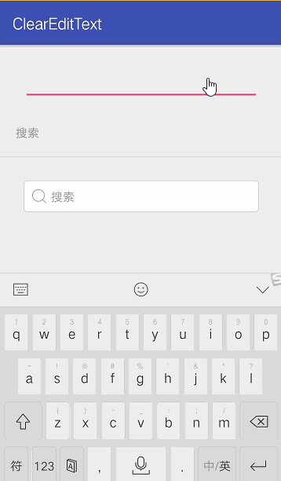

# ClearEditText
<<<<<<< HEAD
自定义EditText,当有内容的时候出现删除，点击删除按钮清空内容。重写OnTouch事件，主要是判断删除按钮
# Screenshots

=======
只需要一个ClearEditText.java文件就可以了
# Screenshots

>>>>>>> origin/master
# Sample
用法和普通的EditText相同，把自定义的路径写对就行
``` xml
<com.lonelypluto.clearedittext.ClearEditText
        android:layout_width="match_parent"
        android:layout_height="wrap_content"
        android:textSize="15sp"
        />
```
<<<<<<< HEAD

=======
>>>>>>> origin/master
